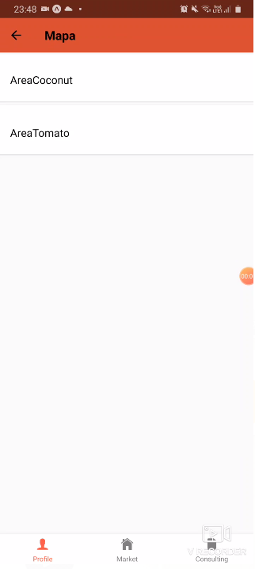

# Nasa-Covid19-Challenge

### Backend deploy
The backend was deployed at Oracle and you can check at:
https://nasa.brartc.com/docs

## The Project
The challenge consists in mitigating the impact of covid 19 in our complex food supply chain. In our quest to find a solution, we discovered that the beginning of the chain, the small family producer, where suddenly without a market to sell its produce, because street markets and restaurants, the main consumers, where closed. On the other hand, the very tip of the chain, the consumers, where suffering food shortages. So we decided to develop a digital intermediate that would provide a safe logistic train, to connect the two ends of the chain. Providing food security for those who need, and helping the families of the small producers.

## Technologies
Blockchain technology

FastApi used in backend

Oracle

React Native used in frontend

Lambda structured functions

Firebase 

Python language

## Impacts
The big impact of our project focuses at the food chain, where it needs to be restructured due to this situation we are facing. We try to mitigate the waste of food because of low demand and lack of nutrition because of individuals that needed the public government system

## Images
Here we show you some of our screens.

## Keywords
Supplychain

Food chain

Blockchain

Nutrition

Food

